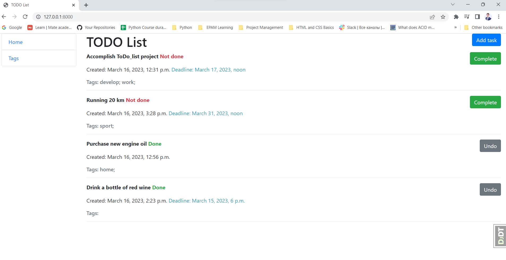

# ToDo

Django project for managing ToDo list.


## Installation

Python3 must be already installed.

```shell
git clone https://github.com/MykytaMoshchenko/ToDo.git
cd ToDo_list
python3 -m venv venv
source venv/bin/activate
pip install -r requirements.txt
python manage.py runserver
```


## Features

* Managing tasks directly from the website, creating tasks, setup deadlines, update complete status of the tasks.
* Powerful admin panel for advanced managing


## Demo


